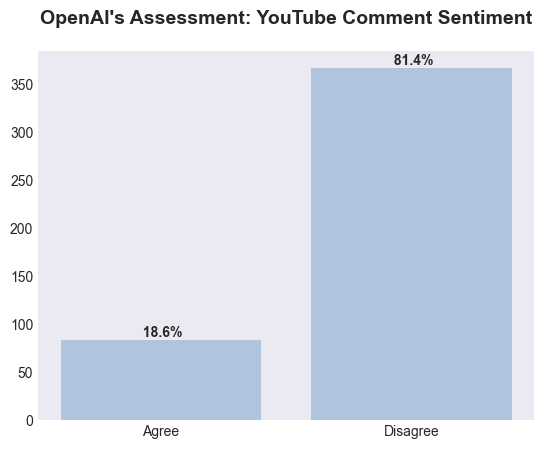
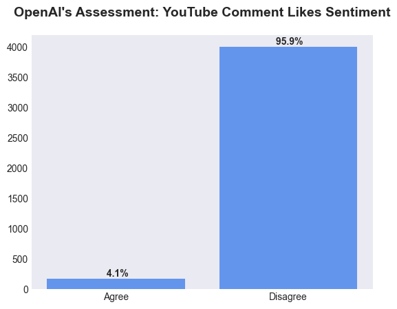
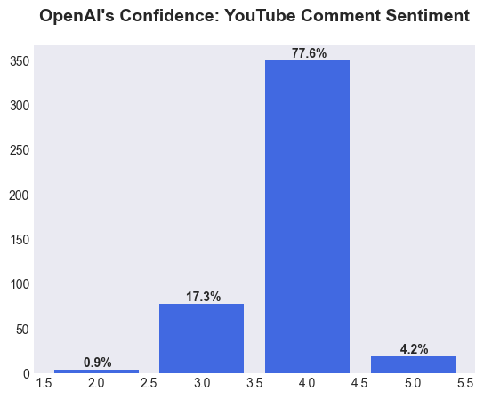
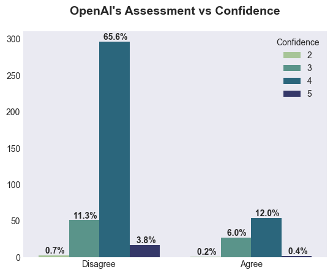
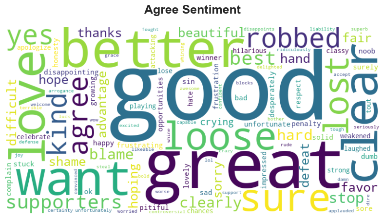
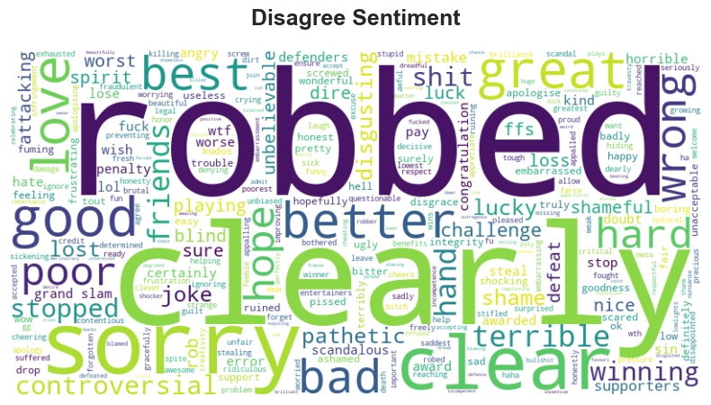

<h1 style="text-align:center;">
2024 Six Nations Drama:
 
Analyzing YouTube Reactions to Try Decision 
 
Did France Deserve the Win or Was Scotland Robbed?
</h1>

Credit: The Times

The 2024 Six Nations rugby clash between Scotland and France delivered a gripping and controversial moment in the final seconds, where an inconclusive try review determined the outcome. For those unfamiliar with rugby, a try involves scoring points by grounding the ball in the opposition's in-goal area. Trailing 16-20 with no time left on the clock, Scotland had one more chance to score a try and secure a dramatic victory over France.
  

Scotland's Sam Skinner powered over the line, met by a swarm of bodies as he attempted to ground the ball. Amid the tangle of players, the ball is visible just above the yellow boot. To validate a try, the ball must be firmly grounded.

Credit: BBC

 
On-field referee Nic Berry initially ruled no-try but requested a video review from Television Match Official (TMO) Brian MacNeice.

Credit: Getty Images

 
Despite potential evidence suggesting otherwise, MacNeice asserted that there was no definitive proof to confirm Skinner scored, giving France a nerve-wracking 20-16 victory.

Credit: Reuters

 
 This pivotal decision has sparked widespread discussions and debates among rugby enthusiasts and fans.

This project seeks to explore and analyze public sentiment surrounding this contentious last-second decision using the comments section of the [official Six Nations YouTube highlight video](https://www.youtube.com/watch?v=Rcst-jIOQDo). <b>The goal is to determine whether the majority of viewers agree with the no-try decision by leveraging OpenAI's GPT-3.5 Turbo model and sentiment analysis techniques.</b>

 

## Data
Data collection was performed utilizing the Google YouTube API, which facilitated the extraction of comments from the highlight video. This API enabled retrieval of comments and likes associated with the video, offering valuable insights into the diverse reactions and opinions of the viewers. Subsequently, the comments underwent evaluation using OpenAI's GPT model to gauge sentiment regarding the contentious last-second call.

The iterative development of the prompt for engaging with OpenAI's GPT model involved detailed refinement. The primary objective was to enhance the model's comprehension of pivotal moments related to the contentious decision and address nuances like sarcasm and negation inherent in sentiment analysis challenges.

Through a series of prompt iterations, testing was conducted using complex and challenging comments. Optimal model performance was reached when asked to pass judgement on whether the commenter 'Agrees' or 'Disagrees' with the outcome of the match and provide a confidence score on a scale of 1 to 5, where 1 signifies low confidence and 5 reflects high confidence.

The culmination of this iterative process resulted in the below prompt used for interaction with the GPT model.
> <b>Scotland were denied victory by an inconclusive last-second try review as France held on to win a tense Six Nations rugby encounter. Replays suggested the ball was grounded by Sam Skinner but the on-field referee, Nic Berry, called no try and the Television Match Official (TMO), claimed to not have the evidence to conclusively prove otherwise. Fan's either agree with the referees' decision of no try, implying that the fan believes the ball was lost and the referees did a good job and France deservedly won ('Agree') OR fan's disagree with the decision of no try, implying that the fan is upset and the ball was grounded and touched the ground and it was a clear try and the referees did a bad job and Scotland was robbed and deserved to win ('Disagree'). Read a fan's statement below and use the criteria above to choose 'Agree' or 'Disagree' and provide a confidence level between 1-5, where 1 means you have low confidence and 5 is high confidence. Separate the word and number with a colon. So your reply should be in the format, word:number.</b>

 

## Analysis
After scraping comments data from the [official Six Nations YouTube highlight video](https://www.youtube.com/watch?v=Rcst-jIOQDo) and utilizing OpenAI's GPT model for categorizing each comment as 'Agree' or 'Disagree' along with a confidence score, the next stage of the project involved collecting summary statistics and performing a sanity check on OpenAI's sentiment assessment of the most liked comments.

> The video was posted on Feb 10, 2024 and as of Feb 16, 2024, has reached <b>357,447</b> views, with <b>451</b> comments and <b>4,172 likes</b>.

> Below are the top 5 comments based on number of likes and their respective classifications and confidence scores. Each comment is correctly identified as <b>'Disagree'</b>.
> 1. <b>"Like if Scotland were robbed" </b> (1,383 likes | Disagree:4)
> 2. <b>"As a frenchman, used to being cheated, I must say it's sad to win this way. The last try seemed valid. Sorry my Scottish friends, totally undeserved defeat for you." </b> (433 likes | Disagree:4)
> 3. <b>"Frenchman here . Finn russell is a real gentleman smiling to the french while being robbed and shaking hands . Wonderful player wonderful spirit. NO ENGLISHMAN WOULD DO THAT, that's why we love Scotland !" </b> (387 likes | Disagree:4)
> 4. <b>"On behalf of many, many French supporters, I would like to apoligise for the outcome of this match and obviously this isn't going to compensate for anything:  Of course there was a try. Nobody here is celebrating! It's a shameful victory! Secondly, what a crowd you guys are!  I was already a huge fan of your team and supporters, but the reaction of the crowd and the respectful manner in which they had to accept the defeat is totally remarkable! French supporters would've never risen to the occasion if they had been defeated that way! Hats of guys!" </b> (299 likes | Disagree:5)
> 5. <b>"this is the first time in my life that I am angry after a victory myself as a Frenchman there is clearly try anyway bravo to you scotland always plays a very nice rugby" </b> (191 likes | Disagree:4)

 

### Sentiment Distribution
Following the compilation of summary statistics and the completion of a sanity check, the next phase of the project involved the visualization of OpenAI's sentiment assessment regarding the contentious no-try decision. Below are charts illustrating the distribution of comments, likes, confidence scores, and the correlation between assessment and confidence scores.

> <b>81.4%</b> of comments <b><u>disagree</b></u> with the referee's decision
 

> Comments that <b><u>disagreed</b></u> with the referee's decision also had the most likes, <b>95.9%</b>
 

> OpenAI's GPT model was very confident in categorizing comments with <b>81.8%</b> of comments receiving a confidence score of 4 or 5
 

> <b>65.6%</b> of comments were classified as "Disagree" with a confidence score of 4
 

 

### Word Clouds
After assessing the overall distribution of feedback from OpenAI, each comment underwent tokenization and cleansing using [spaCy](https://spacy.io/), a free open-source library for Natural Language Processing. The processed text was then subjected to analysis using the [VADER model](https://ojs.aaai.org/index.php/ICWSM/article/view/14550), a rule-based model for sentiment analysis of social media text. This preprocessing step eliminated "neutral" words from the comments, retaining only expressions of positive or negative sentiment. Finally, the refined words were utilized to generate word clouds, providing visual representations of YouTube comments where the word size reflects its frequency within the comment.

> Comments aligning with the referee's decision conveyed positivity through words like <b>good</b>, <b>great</b>, <b>better</b>, and <b>love</b>. These terms reflect satisfaction with the referee's decision, suggesting a sentiment that favors the view that France performed well and were the better team.
 

> Comments expressing disagreement with the referee's decision exhibited a negative sentiment, prominently employing the words <b>clearly</b> <b>robbed</b>. This choice of language signifies a strong disapproval of the referee's judgement and, consequently, dissatisfaction with the overall outcome of the match.
 

 

### OpenAI's GPT Summary
The concluding stage of the project reengaged OpenAI's GPT model to encapsulate the prevailing sentiment within comments with the highest confidence scores. Comments were separated by their classification, filtered based on confidence score of 4 or 5, and sorted in descending order by number of likes. The top 50 comments from each group were then systematically gathered. The GPT model was tasked to provide the overarching theme using 3 sentences, below are the responses.

> Summary of the <b>'Agree'</b> comments: 
> "French fans are happy about the favorable referee decision, while some believe that Scotland had their chances and should not blame the officials. Many feel that the decision to not award the try was correct due to lack of clear evidence of grounding. Overall, the game was seen as hard-fought and controversial, with some acknowledging that the rules were followed despite frustrations."

 

> Summary of the <b>'Disagree'</b> comments: 
> "Many viewers felt that Scotland was robbed of a victory in the match against France, with some even admitting that it was a clear try for Scotland. Fans from various countries expressed disappointment with the outcome of the game and criticized the officiating. Despite the controversy, many praised the sportsmanship shown by Scotland and the respectful manner in which they accepted the defeat."

 

## Conclusion
The analysis of YouTube reactions to the controversial no-try decision in the 2024 Six Nations clash between Scotland and France revealed a polarized sentiment among viewers. The project leveraged OpenAI's GPT-3.5 Turbo model and sentiment analysis techniques to categorize comments into 'Agree' or 'Disagree' based on their stance on the decision.

The sentiment distribution charts illustrated a signficant disagreement with the referee's decision with <b>81.4%</b> of comments expressing dissent. Interestingly, comments in disagreement also had the highest number of likes, emphasizing viewer dissatisfaction.

Word clouds provided a nuanced understanding of the sentiment conveyed in the comments. Positive sentiments among 'Agree' comments reflected satisfaction with the referee's decision through words like <b>good</b>, <b>great</b>, <b>better</b>, and <b>love</b>. Conversely, 'Disagree' comments were characterized by negative terms like <b>clearly</b> <b>robbed</b>, signifying strong disapproval. 

The GPT model's summaries of top comments in each category reinforced the diverse perspectives. 'Agree' comments seemed to acknowledge the controversial nature of the match but were satisfied with the adherence to rules. On the other hand, 'Disagree' comments reflected a sentiment of being robbed and viewers from various countries criticized the officiating.

The analysis provided valuable insights into the intricate web of emotions and opinions surrounding the decisive no-try call. The project not only captured the essence of viewer sentiments but proved OpenAI's GPT model can accurately and efficiently tackle complex, nuanced analyses in sports controversies.