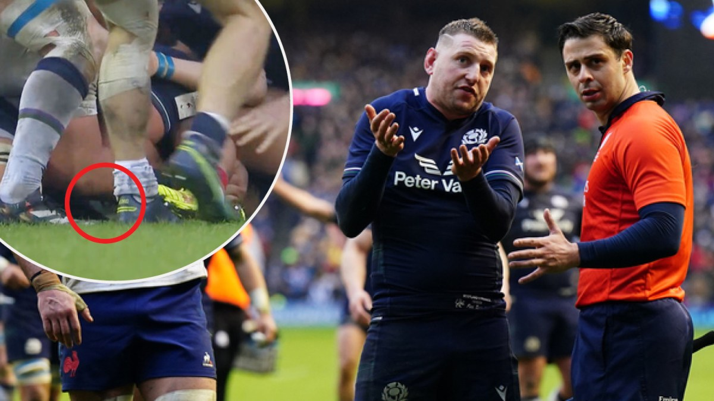
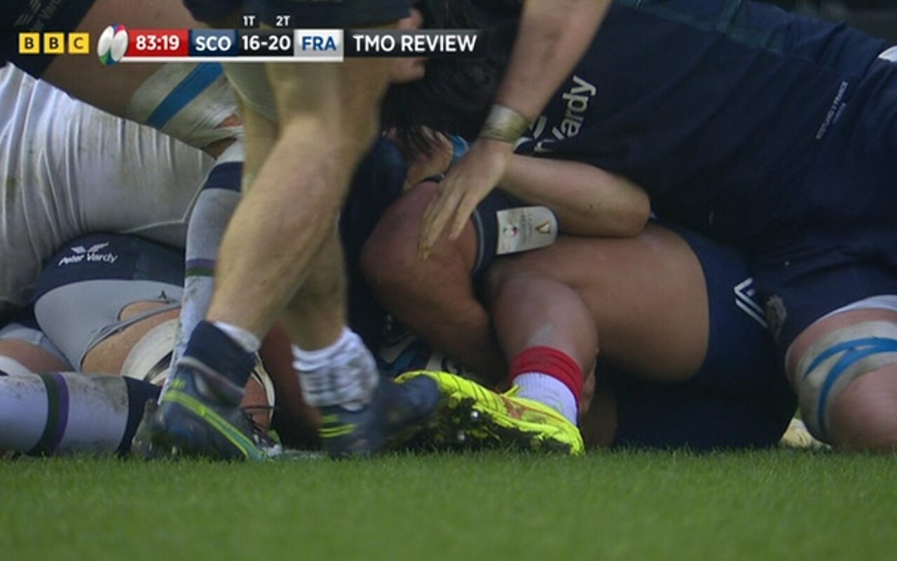
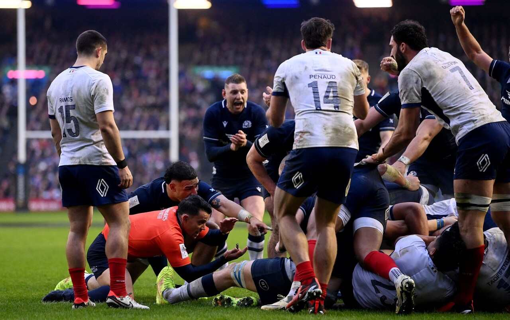
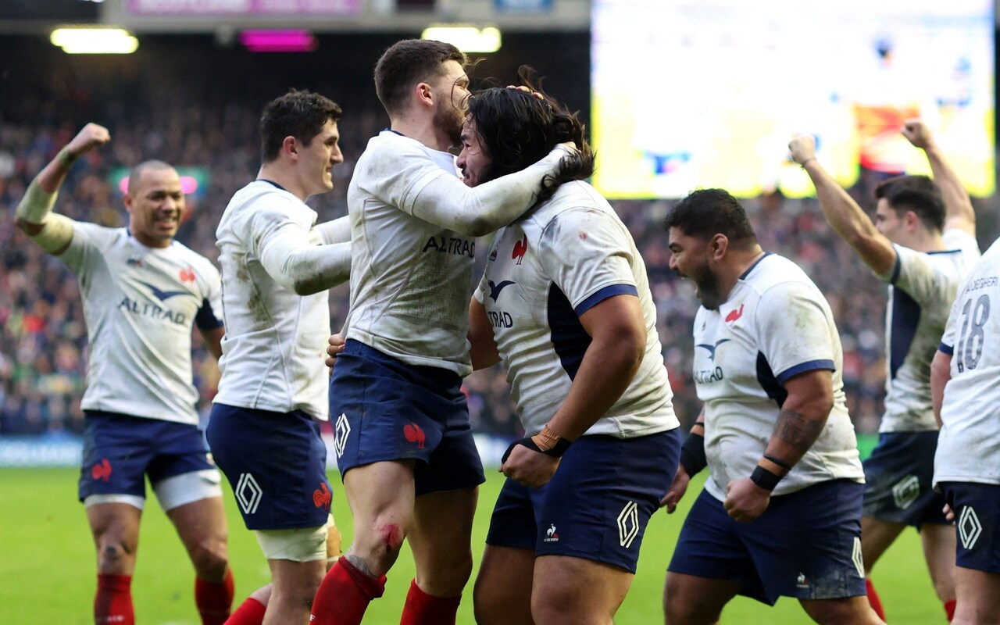

<h1 style="text-align:center;">
2024 Six Nations Drama:
 
Analyzing YouTube Reactions to Try Decision 
 
Did France Deserve the Win or Was Scotland Robbed?
</h1>

Credit: The Times

The 2024 Six Nations rugby clash between Scotland and France delivered a gripping and controversial moment in the final seconds, where an inconclusive try review determined the outcome. For those unfamiliar with rugby, a try invovles scoring points by grounding the ball in the opposition's in-goal area. Trailing 16-20 with no time left on the clock, Scotland had one more chance to score a try and secure a dramatic victory over France.
  

Scotland's Sam Skinner powered over the line, met by a swarm of bodies as he attempted to ground the ball. Amid the tangle of players, the ball is visible just above the yellow boot. To validate a try, the ball must be firmly grounded.

Credit: BBC

 
On-field referee Nic Berry initially ruled no-try but requested a video review from Television Match Official (TMO) Brian MacNeice.

Credit: Getty Images

 
Despite potential evidence suggesting otherwise, MacNeice asserted that there was no definitive proof to confirm Skinner scored, giving France a nerve-wracking 20-16 victory.

Credit: Reuters

 
 This pivotal decision has sparked widespread discussions and debates among rugby enthusiats and fans.

This project seeks to explore and analyze public sentiment surrounding this contentious last-second decision using the comments section of the [official Six Nations YouTube highlight video](https://www.youtube.com/watch?v=Rcst-jIOQDo). <b>The goal is to determine whether the majority of viewers agree with the no-try decision by leveraging OpenAI and sentiment analysis techniques.</b>

 

## Data
Data collection was performed utilizing the Google YouTube API, which facilitated the extraction of reactions from the highlight video. This API allowed access to and retrieval of comments, replies, and likes associated with the video, offering valuable insights into the diverse reactions and opinions of the viewers. Subsequently, the comments and replies underwent evaluation using OpenAI's API to gauge sentiment regarding the contentious last-second call.

The prompt below was used to interact with OpenAI to evaluate each comment and replies' sentiment.
> Scotland were denied victory by an inconclusive last-second try review as France held on to win a tense Six Nations rugby encounter. Replays suggested the ball was grounded by Sam Skinner but the on-field referee, Nic Berry, had called no-try and the Television Match Official (TMO), Brian MacNeice, claimed to not have the evidence to conclusively prove otherwise. I want you to analyze the following text and determine whether they agree with the no-try decision meaning France fairly, deservedly won the game ("Agree") or whether they disagree with the no-try decision meaning it was a try and Scotland was robbed and deserved to win ("Disagree"). I only want you to reply to this with "Agree" or "Disagree" but if you really can't make a decision then reply "Inconclusive".
 

 

## Analysis
### Sentiment Distribution
> <b>__%</b> of comments disagree with the no-try decision
 PUT DISTRIBUTION HERE

> Comments that disagreed with the no-try decision also had the most likes <b>__%</b>
 PUT DISTRIBUTION HERE

> <b>__%</b> of replies to comments also disagreed with the no-try decision
 PUT DISTRIBUTION HERE

 

### Word Clouds
Visual representation of comments where the size of the word corresponds to its frequency within the comment.

> The top words in comments that agree with the try decision are ___, ____, and ____
 PUT WORD CLOUD HERE

> The top words in comments that disagree with the try decision are ___, ____, and ____
 PUT WORD CLOUD HERE

> The top words in comments that are indistinguishable are ___, ____, and ____
 PUT WORD CLOUD HERE

 

### Top Reactions
> The comment with the most likes is _____

> The comment with the most replies expressing divergent viewpoints is ____ 

> The most common word that expresses an opinion on the try decision is ___

 

## Conclusion